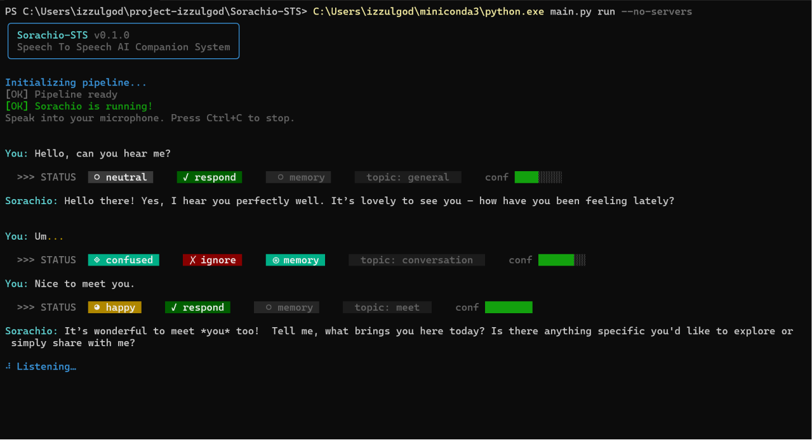
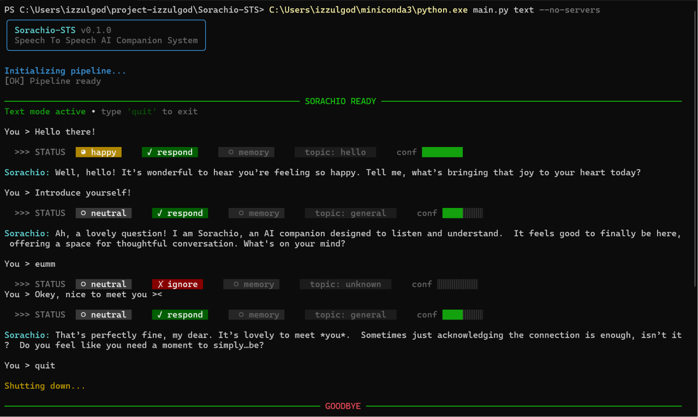

# Sorachio-STS 🤖

> **Speech To Speech AI Companion System**
> *Foundation for a future robotics companion platform*

---

### 🖥️ System in Action (CLI Showcase)

Here is a preview of how the interactive CLI behaves in different operational modes, showcasing the real-time **Cognitive Gateway** status bar and state transitions.

#### 1. Full Voice/Run Mode (`main.py run`)
In voice mode, the pipeline continuously monitors microphone input using VAD. Once speech is detected and transcribed, the Cognitive Gateway immediately computes the emotional state, topic, and response confidence, seamlessly transitioning into the streaming audio playback phase. Filler or hesitant speech (e.g., "Um...") is filtered out and marked as `X ignore`, preventing unnecessary processing on non-substantive input.




#### 2. Interactive Text Mode (`main.py text`)
In text mode, you can chat with the companion using keyboard inputs. This mode is perfect for testing prompts and observing how the Cognitive Gateway filters out filler words (e.g., "eumm") by marking them as `X ignore`, just like in voice mode — saving valuable compute cycles.



---

## Table of Contents

1. [Project Overview](#1-project-overview)
2. [Architecture Diagram](#2-architecture-diagram)
3. [Data Flow](#3-data-flow)
4. [Folder Structure](#4-folder-structure)
5. [Threading Model](#5-threading-model)
6. [Prerequisites](#6-prerequisites)
7. [Installation Guide](#7-installation-guide)
8. [Model Setup](#8-model-setup)
9. [Running the System](#9-running-the-system)
10. [Configuration Guide](#10-configuration-guide)
11. [Cognitive Gateway Explained](#11-cognitive-gateway-explained)
12. [Streaming Pipeline Explained](#12-streaming-pipeline-explained)
13. [Memory Architecture](#13-memory-architecture)
14. [CLI Reference](#14-cli-reference)
15. [Troubleshooting](#15-troubleshooting)
16. [Future Robotics Expansion](#16-future-robotics-expansion)

---

## 1. Project Overview

Sorachio-STS is a **complete, local-first, real-time Speech-to-Speech (STS) AI Companion** system. It runs entirely on your local machine — no cloud APIs, no subscriptions, no data sent anywhere.

The system is designed from the ground up as a **scalable AI companion operating system** — not a toy chatbot — with architecture that anticipates future expansion into robotics, multi-agent systems, cameras, sensors, and ROS2 integration.

### Key Properties

| Property | Detail |
|----------|--------|
| **Fully Local** | All inference runs on-device via llama.cpp |
| **Real-Time Streaming** | TTS begins before LLM finishes generating |
| **Two-LLM Architecture** | Cognitive Gateway + Personality Core |
| **Interruptible** | VAD detects user speech, stops playback instantly |
| **Persistent Memory** | Remembers you across sessions (JSON → future vector DB) |
| **Modular** | Each component is a separate async worker |
| **Rich CLI UI** | Transient spinners, animated loaders, and cognitive status pills |

---

## 2. Architecture Diagram

```
┌─────────────────────────────────────────────────────────────────┐
│                    Sorachio-STS Pipeline                        │
│                                                                 │
│  ┌──────────┐    ┌──────────────┐    ┌─────────────────────┐   │
│  │Microphone│───▶│ AudioCapture │───▶│   STT Queue         │   │
│  └──────────┘    │  (VAD)       │    │   (asyncio.Queue)   │   │
│                  └──────────────┘    └────────┬────────────┘   │
│                        │ interrupt             │                │
│                        ▼                       ▼                │
│               ┌─────────────────┐   ┌──────────────────────┐   │
│               │  PlaybackState  │   │   STT Worker         │   │
│               │  (asyncio.Event)│   │   (whisper.cpp CLI)  │   │
│               └─────────────────┘   └────────┬─────────────┘   │
│                                              │ transcript       │
│                                              ▼                  │
│                                   ┌──────────────────────┐     │
│                                   │  Cognitive Worker    │     │
│                                   │  LLM #1              │     │
│                                   │  Qwen3-0.6B          │     │
│                                   │  → JSON decision     │     │
│                                   └────────┬─────────────┘     │
│                                            │ decision           │
│                                            ▼                    │
│                         ┌──────────────────────────────────┐   │
│                         │         Memory System            │   │
│                         │  ┌────────────┐ ┌────────────┐   │   │
│                         │  │  STM       │ │  LTM       │   │   │
│                         │  │(in-memory) │ │(JSON file) │   │   │
│                         │  └────────────┘ └────────────┘   │   │
│                         └────────────┬─────────────────────┘   │
│                                      │ context                  │
│                                      ▼                          │
│                         ┌────────────────────────────────────┐ │
│                         │       Context Manager              │ │
│                         │ system prompt + STM + LTM + emotion│ │
│                         └────────────┬───────────────────────┘ │
│                                      │ messages[]               │
│                                      ▼                          │
│                         ┌────────────────────────────────────┐ │
│                         │    Personality Worker              │ │
│                         │    LLM #2 (gemma-3-1b-it)          │ │
│                         │    Streaming token generation      │ │
│                         └────────────┬───────────────────────┘ │
│                                      │ token stream             │
│                                      ▼                          │
│                         ┌────────────────────────────────────┐ │
│                         │      Chunk Assembler               │ │
│                         │  sentence boundary detection       │ │
│                         │  "Hello there." "How are you?"    │ │
│                         └────────────┬───────────────────────┘ │
│                                      │ speech chunks            │
│                                      ▼                          │
│                         ┌────────────────────────────────────┐ │
│                         │      TTS Worker (Kokoro)           │ │
│                         │      per-chunk synthesis           │ │
│                         └────────────┬───────────────────────┘ │
│                                      │ audio arrays             │
│                                      ▼                          │
│                         ┌────────────────────────────────────┐ │
│                         │  Audio Playback Queue              │ │
│                         │  (interruptible, sounddevice)      │ │
│                         └────────────┬───────────────────────┘ │
│                                      │                          │
│                                      ▼                          │
│                                  ┌───────┐                      │
│                                  │Speaker│                      │
│                                  └───────┘                      │
└─────────────────────────────────────────────────────────────────┘
```

### Server Architecture

```
Python Orchestrator (asyncio event loop)
│
├── HTTP → llama-server :8001 ── LLM #1 Cognitive Gateway (Qwen3-0.6B-Q8_0)
├── HTTP → llama-server :8002 ── LLM #2 Personality Core (gemma-3-1b-it-Q8_0)
├── Subprocess → whisper-cli    ── STT (whisper-base.en)
└── In-process → Kokoro         ── TTS (kokoro Python library)
```

---

## 3. Data Flow

### Full Pipeline Flow

```
[User speaks]
    │
    ▼ PCM bytes (16kHz, 16-bit mono)
[webrtcvad] ─ silence detected ─▶ speech segment assembled
    │
    ▼ audio bytes
[stt_queue] ─────────────────────▶ [STT Worker]
    │                                    │
    │                          whisper-cli subprocess
    │                                    │
    │                          ◀─ transcript string
    │
    ▼
[cognitive_queue] ─────────────▶ [Cognitive Worker]
    │
    │  POST /v1/chat/completions
    │  to llama-server:8001 (Qwen3)
    │
    ▼ JSON decision:
    {
        "respond": true,
        "emotion": "anxious",
        "topic": "education",
        "store_memory": true,
        "importance": 0.85,
        "memory_queries": ["exam", "stress"]
    }
    │
    ├── LTM retrieval (memory_queries → top-K memories)
    ├── STM injection (last N messages)
    ├── Emotional context injection
    └── Personality prompt assembly
    │
    ▼ messages[]
[Personality Worker]
    │
    │  POST /v1/chat/completions (stream=true)
    │  to llama-server:8002 (gemma-3-1b-it)
    │
    ▼ token stream: "Hello " "there! " "I " "can " "hear " ...
    │
[Chunk Assembler]
    │
    ▼ "Hello there!" → TTS → Audio → Speaker
    │ "I can hear that you're stressed." → TTS → Audio → Speaker
    │ "Tell me more about what's going on." → TTS → ...
    │
    ▼ (while still streaming LLM tokens!)

[STM] ← store user message + response
[LTM] ← conditionally store if importance >= threshold
```

---

## 4. Folder Structure

```
Sorachio-STS/
│
├── main.py                 # Entry point
├── requirements.txt        # Python dependencies
├── README.md
│
├── config/                 # Configuration system
│   ├── sorachio.yaml       # Master config (edit this!)
│   └── settings.py         # Pydantic settings loader
│
├── core/                   # Pipeline orchestrator
│   ├── pipeline.py         # Master async pipeline
│   └── events.py           # Event bus (pub/sub)
│
├── audio/                  # Audio I/O
│   ├── capture.py          # Mic capture + VAD
│   └── playback.py         # Interruptible playback queue
│
├── stt/                    # Speech-to-Text
│   └── whisper_client.py   # whisper.cpp subprocess client
│
├── tts/                    # Text-to-Speech
│   └── kokoro_client.py    # Kokoro streaming TTS client
│
├── cognition/              # LLM #1 — Cognitive Gateway
│   └── cognitive_gateway.py
│
├── llm/                    # LLM HTTP clients
│   └── llama_client.py     # Async llama-server client
│
├── context/                # Context Manager
│   └── context_manager.py  # Prompt assembly
│
├── memory/                 # Memory System
│   ├── short_term.py       # Rolling conversation window
│   └── long_term.py        # JSON persistent memory + retrieval
│
├── personality/            # LLM #2 — Personality Core
│   └── personality_core.py # Streaming conversation engine
│
├── services/               # External service management
│   └── server_manager.py   # llama-server lifecycle
│
├── utils/                  # Utilities
│   ├── logging_setup.py    # Structured logging (Rich + file)
│   └── chunk_assembler.py  # Token → speech chunk converter
│
├── cli/                    # CLI interface
│   └── main.py             # All commands (run, text, test-*, ...)
│
├── scripts/                # Setup & build scripts
│   ├── setup_env.ps1           # Install Python deps
│   ├── build_llamacpp.ps1      # Build llama-server
│   ├── build_whispercpp.ps1    # Build whisper-cli
│   ├── download_whisper_model.ps1
│   ├── setup_kokoro.ps1        # Install Kokoro TTS
│   └── start_servers.ps1       # Launch LLM servers
│
├── models/                 # Local model files
│   ├── llm1/               # Qwen3-0.6B-Q8_0.gguf
│   ├── llm2/               # gemma-3-1b-it-Q8_0.gguf
│   └── stt/                # ggml-base.en.bin (downloaded)
│
├── bin/                    # Built binaries (auto-created)
│   ├── llama-server.exe
│   └── whisper-cli.exe
│
├── data/
│   └── memory/
│       └── ltm.json        # Long-term memory (auto-created)
│
├── logs/                   # Runtime logs
│   ├── sorachio.log
│   ├── llm1_server.log
│   └── llm2_server.log
│
├── sensors/                # Future: cameras, IMU, LIDAR
└── actuators/              # Future: motors, servos, LED rings
```

---

## 5. Threading Model

Sorachio-STS uses a **hybrid threading model**:

```
Main Thread (asyncio event loop)
│
├── [asyncio Task] STT Worker           — awaits stt_queue, calls subprocess
├── [asyncio Task] Cognitive Worker     — awaits cognitive_queue, HTTP to LLM #1
├── [asyncio Task] Personality Worker   — HTTP streaming to LLM #2
├── [asyncio Task] TTS Worker           — synthesizes chunks in thread executor
├── [asyncio Task] Playback Worker      — drains audio queue, plays via sounddevice
│
├── [Thread] VAD Worker                 — continuous mic monitoring (webrtcvad)
│   └── puts audio to stt_queue via run_coroutine_threadsafe()
│
└── [Thread Executor] Kokoro Synthesis  — blocking TTS synthesis offloaded to thread
```

**Why this design?**
- `asyncio` handles all I/O-bound work (HTTP, queues, file I/O) efficiently
- CPU-bound work (synthesis, subprocess) runs in thread executors
- VAD runs in a dedicated thread for lowest possible latency
- No GIL contention issues — audio capture is pure C (sounddevice/PortAudio)

---

## 6. Prerequisites

### Required
| Tool | Version | Download |
|------|---------|----------|
| Python | 3.11+ | [miniconda.org](https://docs.conda.io/en/latest/miniconda.html) |
| Git | Any | [git-scm.com](https://git-scm.com) |
| CMake | 3.20+ | [cmake.org](https://cmake.org/download/) |
| MSVC / Build Tools | 2019+ | [Visual Studio](https://visualstudio.microsoft.com/visual-cpp-build-tools/) |
| Microphone | Any | Built-in or USB |
| Speakers/Headphones | Any | For audio output |

---

## 7. Installation Guide

You can install all dependencies, build the required servers and clients, and download the default models automatically or step-by-step.

### Option A: Automatic Setup (Recommended)

Run the master setup orchestrator script from the project root:

```powershell
.\install.ps1
```

This script will guide you step-by-step through installing the Python dependencies, building `llama-server.exe`, building `whisper-cli.exe`, downloading the default Whisper model, and optionally setting up Kokoro TTS.

---

### Option B: Step-by-Step Manual Setup

#### Step 1: Install Python Dependencies

```powershell
.\scripts\setup_env.ps1
```

This installs: `httpx`, `pydantic`, `sounddevice`, `webrtcvad`, `rich`, `typer`, `aiofiles`, `pytest`, etc.

#### Step 2: Build llama.cpp (LLM Inference Server)

```powershell
.\scripts\build_llamacpp.ps1
```

This clones `https://github.com/ggml-org/llama.cpp`, builds it with CMake, and puts `llama-server.exe` and its libraries in `bin/`.

> ⏱️ **Build time**: ~5–15 minutes depending on your CPU.

#### Step 3: Build whisper.cpp (STT)

```powershell
.\scripts\build_whispercpp.ps1
```

Builds `whisper-cli.exe` and its supporting libraries, then puts them in `bin/`.

#### Step 4: Download Whisper Model

```powershell
.\scripts\download_whisper_model.ps1
```

Downloads `ggml-base.en.bin` (~148 MB) to `models/stt/`.

#### Step 5: Install Kokoro TTS (Optional but recommended)

```powershell
.\scripts\setup_kokoro.ps1
```

> ⚠️ This downloads PyTorch (~500MB CPU / ~2GB GPU). The system works without TTS — responses print to console instead.

#### Step 6: Verify Installation

```powershell
# Check all components
python main.py servers status
```

---

## 8. Model Setup

### LLM Models

| Model | Path | Role |
|-------|------|------|
| Qwen3-0.6B-Q8_0 | `models/llm1/Qwen3-0.6B-Q8_0.gguf` | Cognitive Gateway |
| gemma-3-1b-it-Q8_0 | `models/llm2/gemma-3-1b-it-Q8_0.gguf` | Personality Core |

### STT Model

| Model | Size | Accuracy | Speed |
|-------|------|----------|-------|
| ggml-tiny.en.bin | 75MB | ★★☆☆☆ | ⚡⚡⚡⚡ |
| **ggml-base.en.bin** | 148MB | ★★★☆☆ | ⚡⚡⚡☆ ← **Default** |
| ggml-small.en.bin | 488MB | ★★★★☆ | ⚡⚡☆☆ |
| ggml-medium.en.bin | 1.5GB | ★★★★★ | ⚡☆☆☆ |

---

## 9. Running the System

### Always use the full Python path:

```powershell
$PYTHON = "C:\Users\izzulgod\miniconda3\python.exe"
```

### Quick Start — Text Mode (no microphone required)

```powershell
# 1. Start LLM servers
.\scripts\start_servers.ps1

# 2. Run in text mode (servers already running)
C:\Users\izzulgod\miniconda3\python.exe main.py text --no-servers
```

### Full Voice Mode

```powershell
# Starts servers AND voice pipeline
C:\Users\izzulgod\miniconda3\python.exe main.py run
```

### Single Message Test

```powershell
C:\Users\izzulgod\miniconda3\python.exe main.py text -m "Hello Sorachio, how are you?" --no-servers
```

---

## 10. Configuration Guide

All configuration lives in `config/sorachio.yaml`.

### Key Settings to Customize

```yaml
# Change companion name/personality
context:
  companion_name: "Sorachio"
  personality_prompt: |
    You are Sorachio, a warm AI companion...

# Adjust LLM creativity
llm:
  personality_core:
    temperature: 0.8      # 0.1=focused, 1.2=creative
    max_tokens: 512

# TTS voice (see kokoro docs for available voices)
tts:
  voice: "af_heart"       # or: af_bella, am_adam, bf_emma, etc.
  speed: 1.0              # 0.5=slow, 2.0=fast

# Memory thresholds
memory:
  long_term:
    importance_threshold: 0.5   # Only store memories above this score

# GPU acceleration (if you have a GPU)
llm:
  cognitive_gateway:
    n_gpu_layers: 35      # Set -1 for all layers on GPU
  personality_core:
    n_gpu_layers: 35
```

### Environment Variables

You can override config values with environment variables:

```powershell
$env:SORACHIO_LOG_LEVEL = "DEBUG"
```

---

## 11. Cognitive Gateway Explained

**LLM #1** (Qwen3-0.6B) acts as a fast routing and filtering brain. It **never generates conversation** — only makes structured decisions.

### Why a separate Cognitive LLM?

Without a cognitive layer, the personality LLM would:
- Respond to background TV/music as if spoken to
- Have no way to determine emotional tone
- Generate responses even when not addressed
- Have no automatic memory prioritization

The Cognitive Gateway handles all of this in <500ms.

### Input / Output

**Input** (from STT):
```
"Hey Sorachio, I've been really stressed about my exams this week."
```

**Output** (JSON):
```json
{
    "respond": true,
    "addressed_to_ai": true,
    "store_memory": true,
    "importance": 0.91,
    "emotion": "anxious",
    "topic": "education",
    "memory_queries": ["exam", "stress", "study"],
    "confidence": 0.88
}
```

### Visual Status Indicator

In both text and run modes, the Cognitive Gateway's decision is visually rendered in real-time as a rich UI pill bar before the response generation begins:

```text
  >>> STATUS   ◕ happy    ✓ respond    ○ memory    topic: general    conf ██████░░
```

This UI provides immediate feedback on the AI's internal state (emotion, decision to respond, memory storage, topic, and confidence level) while the system transitions smoothly using transient loading spinners.

### Thinking Mode Disabled

Qwen3 has a built-in reasoning/thinking mode that generates `<think>...</think>` tokens. This is disabled via:

```python
SYSTEM_PROMPT = """/no_think
You are a cognitive filter...
```

This reduces latency from ~3s to ~0.3s for the cognitive decision.

---

## 12. Streaming Pipeline Explained

Sorachio begins **speaking before it finishes thinking**. Here's how:

```
LLM #2 generates:  "Hello " → "there! " → "I " → "can " → "hear " → "you." → ...
                                                                           ↓
Chunk Assembler:            ["Hello there!"]          ["I can hear you."]
                                  ↓                           ↓
TTS Synthesis:            audio₁ ready        audio₂ synthesizing...
                               ↓
Audio Queue:              [audio₁] → playback → speaker
                                          ↓ (while playing)
                                    [audio₂] → queued → next
```

**First audio output** is typically heard within **0.5–1.5 seconds** of the LLM starting — regardless of how long the full response takes.

### Chunk Assembly Strategy

Chunks are assembled by:
1. **Sentence endings**: `.`, `!`, `?`, `;` followed by whitespace
2. **Max word limit**: flush if chunk exceeds 30 words (prevents long pauses)
3. **Minimum word threshold**: don't send single-word fragments

**Good chunks:**
- `"Hello there!"`
- `"How are you doing today?"`
- `"That sounds really stressful."`

**Bad (avoided):**
- `"Hel"` `"lo"` (raw tokens — too fragmented)
- 200-word wall of text (too long — TTS takes forever)

---

## 13. Memory Architecture

### Short-Term Memory (STM)

- **Type**: In-memory rolling deque
- **Capacity**: Last 20 messages (configurable)
- **Content**: role, content, emotion, topic, importance, timestamp
- **Used for**: Recent conversation context injected into LLM #2 prompt
- **Lifecycle**: Cleared on session end (not persistent)

### Long-Term Memory (LTM)

- **Type**: JSON file (`data/memory/ltm.json`)
- **Capacity**: Up to 500 entries
- **Content**: content, topic, emotion, importance, keywords, created_at, access_count
- **Retrieval**: Keyword matching + importance scoring + recency weighting
- **Persistence**: Survives across sessions

#### LTM Retrieval Scoring

```python
relevance = (
    keyword_match_score * 0.5 +
    importance * 0.3 +
    recency_score * 0.2
)
```

#### Future: Vector Database Migration

The LTM is designed for easy migration to ChromaDB, FAISS, or Qdrant. Each `LTMEntry` maps 1:1 to a vector store document. Replace `LongTermMemory._load/_save` with DB calls, and `retrieve()` with semantic vector search.

---

## 14. CLI Reference

```powershell
# Full voice mode
python main.py run [--config path] [--no-greeting] [--no-servers]

# Interactive text mode
python main.py text [--config path] [--no-servers]

# Single message test
python main.py text --message "Hello Sorachio"

# Test individual components
python main.py test-stt [--file audio.wav]
python main.py test-tts "Hello, I am Sorachio!"
python main.py test-cognitive "Hey Sorachio, I feel tired"

# Server management
python main.py servers status
python main.py servers start
python main.py servers stop

# Memory management
python main.py memory list
python main.py memory clear [--yes]
```

---

## 15. Troubleshooting

### "llama-server.exe not found"

Run the build script first:
```powershell
.\scripts\build_llamacpp.ps1
```

### "whisper-cli.exe not found"

```powershell
.\scripts\build_whispercpp.ps1
```

### "No module named 'sounddevice'"

```powershell
C:\Users\izzulgod\miniconda3\Scripts\pip.exe install sounddevice
```

### "No module named 'webrtcvad'"

```powershell
C:\Users\izzulgod\miniconda3\Scripts\pip.exe install webrtcvad-wheels
```

### LLM server not responding

1. Check if servers are running:
   ```powershell
   python main.py servers status
   ```
2. Check server logs:
   ```
   logs\llm1_server.log
   logs\llm2_server.log
   ```
3. Try starting manually:
   ```powershell
   .\scripts\start_servers.ps1
   ```

### Cognitive Gateway returning garbage JSON

- Check that the Qwen3 model path is correct in `config/sorachio.yaml`
- Verify LLM #1 is running: `Invoke-WebRequest http://127.0.0.1:8001/health`
- The `/no_think` prefix in the system prompt disables Qwen3 reasoning mode
- Try increasing `max_tokens` in config if response is getting cut off

### TTS not working

- Kokoro is optional — install with `.\scripts\setup_kokoro.ps1`
- The system works without TTS (responses printed to console)
- Check: `python main.py test-tts "Hello"`

### Audio device issues

Set explicit device in `config/sorachio.yaml`:
```yaml
audio:
  capture:
    device_index: 0    # Use python -m sounddevice to list devices
  playback:
    device_index: 1
```

List devices:
```powershell
C:\Users\izzulgod\miniconda3\python.exe -c "import sounddevice; print(sounddevice.query_devices())"
```

### High latency

For faster response:
1. Enable GPU offload: set `n_gpu_layers: -1` in config (requires CUDA)
2. Use smaller models (tiny, mini variants)
3. Reduce `n_ctx` to 1024 if conversations are short
4. Increase `n_threads` to match your CPU core count

---

## 16. Future Robotics Expansion

Sorachio-STS is architected as the **brain** of a future companion robot.

### ROS2 Integration

The `sensors/` and `actuators/` packages are scaffolded for ROS2 nodes:

```python
# sensors/camera.py (future)
class CameraNode(Node):
    def __init__(self, event_bus: EventBus):
        # Publish EventType.VISUAL_INPUT on detection
        ...

# actuators/servo.py (future)
class ServoController:
    def on_emotion(self, emotion: str):
        # Move face servos based on detected emotion
        ...
```

### Planned Expansion Modules

| Module | Description | Status |
|--------|-------------|--------|
| `sensors/camera.py` | OpenCV face detection, emotion recognition | Planned |
| `sensors/imu.py` | Accelerometer/gyroscope for physical awareness | Planned |
| `actuators/servo.py` | Facial expression servos | Planned |
| `actuators/led.py` | LED ring for emotional state display | Planned |
| `memory/vector_ltm.py` | ChromaDB/FAISS semantic memory | Planned |
| `cognition/vision_gate.py` | Visual cognitive gateway | Planned |
| `core/ros2_bridge.py` | ROS2 topic publisher/subscriber | Planned |
| `agents/task_agent.py` | Goal-oriented sub-agent (LangGraph) | Planned |

### Multi-Agent Architecture (Vision)

```
Sorachio Core Brain
├── Cognitive Gateway (LLM #1) — fast routing
├── Personality Core (LLM #2) — conversation
├── Vision Agent — camera + face recognition
├── Task Agent — goal planning + execution
├── Emotion Agent — multi-modal emotion fusion
└── Memory Agent — LTM consolidation + reflection
```

---

## License

MIT License — see [LICENSE](LICENSE)

## Contributing

This project is a foundation. All contributions welcome:
- Bug fixes and improvements
- New sensor/actuator integrations
- Alternative STT/TTS backends
- Vector database LTM implementation
- ROS2 bridge
- Multi-modal capabilities
