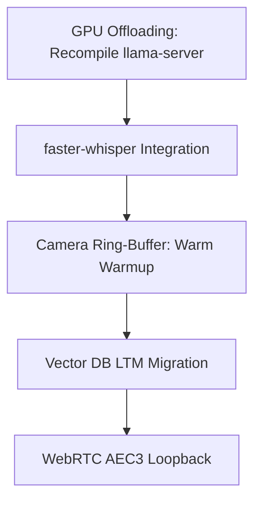

# Sorachio-STS: Future Improvements & Optimization Roadmap

This document outlines the most optimal, high-impact improvements and optimizations you can implement next to elevate the performance, speed, and intelligence of Sorachio-STS.

---

## 1. Speed & Hardware Optimizations (Low Hanging Fruit)

### A. Compile `llama.cpp` with GPU Support (CUDA / Vulkan)
- **Problem**: Currently, your `llama-server` runs entirely on the CPU. The 2B Vision model (LLM2) takes ~6-9 seconds to process image frames, and text generation runs at ~10 tokens/second.
- **Solution**: Rebuild `llama.cpp` with GPU acceleration.
  - For **NVIDIA**: Recompile with CUDA (`cmake -DGGML_CUDA=ON ..`).
  - For **Vulkan** (Intel/AMD/NVIDIA): Recompile with Vulkan (`cmake -DGGML_VULKAN=ON ..`).
- **Impact**: Image processing will drop to **<0.5 seconds**, and text generation will jump to **40-60+ tokens/second**, making interactions feel truly real-time.

### B. Migrate STT from Subprocess to In-Process CTranslate2 (`faster-whisper`)
- **Problem**: Currently, every time you speak, the system launches a subprocess (`whisper-cli.exe`), which adds shell startup latency (~100-200ms) and reads/writes temp audio files.
- **Solution**: Replace the `whisper.cpp` subprocess with `faster-whisper` run inside the python virtual environment.
- **Impact**: Saves 200ms+ of shell overhead per turn, and transcribes speech almost instantaneously using CT2's highly optimized engine.

---

## 2. Memory & Intelligence Upgrades

### A. Semantic Memory with Local Vector Database (ChromaDB / FAISS)
- **Problem**: Current Long-Term Memory (LTM) matches keywords (`ltm.json`). If you say *"I like apples"* and later ask *"What's my favorite fruit?"*, the keyword match fails because "fruit" does not match "apples".
- **Solution**: Migrate LTM to a vector store:
  - Use **ChromaDB** (runs locally in-process).
  - Use a small, local embedding model (like `all-MiniLM-L6-v2` via ONNX Runtime or `sentence-transformers`).
- **Impact**: Sorachio will have true conceptual memory, retrieving information based on meaning rather than exact words.

### B. Memory Consolidation (Reflection Worker)
- **Problem**: Storing memories in real-time can sometimes capture raw, unformatted, or duplicate statements.
- **Solution**: Create a background "Reflection Task" that runs periodically (or at startup/shutdown). It uses LLM1 to review the day's STM/LTM, deduplicate entries, and merge related facts (e.g., merging *"User lives in Jakarta"* and *"User moved to Jakarta last week"* into one clean entry).

---

## 3. Vision & Interaction Enhancements

### A. Continuous Visual Context (Frame Queue)
- **Problem**: Current vision is single-frame snapshot-based. The camera is turned on, captures a frame, and is shut down immediately.
- **Solution**: Run a background webcam thread that keeps a ring-buffer of the last 3-5 frames (at 1 frame per second). When `visual_analysis` is triggered, immediately send the latest frame in the buffer.
- **Impact**: Eliminates the 1-second camera warmup/initialization delay completely. The camera is always "warm" and ready to respond.

### B. Multimodal Video Understanding
- **Problem**: The AI can only see static frames.
- **Solution**: With the ring-buffer implemented, you can send multiple images (e.g., the last 3 snapshots) to LLM2's input context.
- **Impact**: Allows the AI to perceive movement or change over time (e.g., *"Did you see what I just did?"*).

---

## 4. Audio Quality & VAD Refinement

### A. WebRTC AEC3 (Acoustic Echo Cancellation) Integration
- **Problem**: When Sorachio speaks, the system tries to suppress playback from entering the microphone. If the cancellation is weak, Sorachio might hear itself and interrupt its own voice.
- **Solution**: Implement hardware loopback capture using PyAudio or sounddevice, and pass both the reference audio (speaker) and mic input to WebRTC AEC3.
- **Impact**: Highly robust double-talk handling. You can speak over Sorachio even when it is playing loud audio, and it will correctly isolate your voice.

---

## Suggested Implementation Sequence

1. **Phase 1 (Speed)**: GPU compilation + `faster-whisper`. (Makes everything instant).
2. **Phase 2 (UX)**: Camera Ring-buffer. (Eliminates webcam delay).
3. **Phase 3 (Brain)**: Vector DB LTM + memory consolidation. (Makes Sorachio smart).
